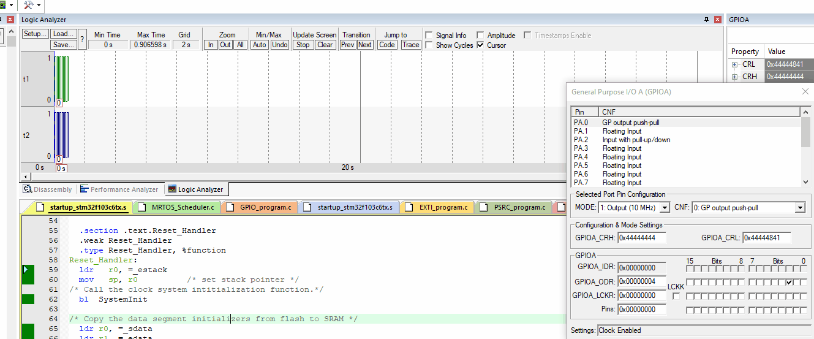

## Queue Example

In this example we created 2 tasks with the same priority.  

in file `MRTOS_Porting.h` Enable usage of queue `ENABLE_BINARY_SAMPHORE` 
```c
#define ENABLE_BINARY_SAMPHORE				1
```
So we need to toggle LED one push button is pressed `ActiveLOW`. but when button state is `HIGH` stop toggling the LED




## Contributing  
Bug reports, feature requests, and so on are always welcome. Feel free to leave a note in the Issues section.

