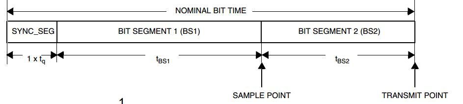
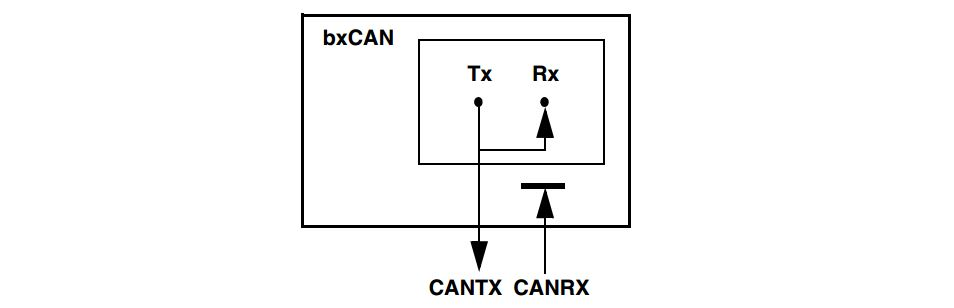
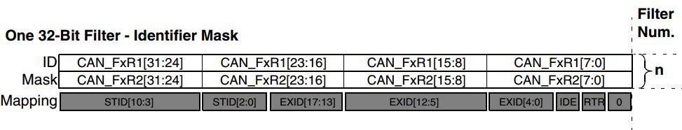
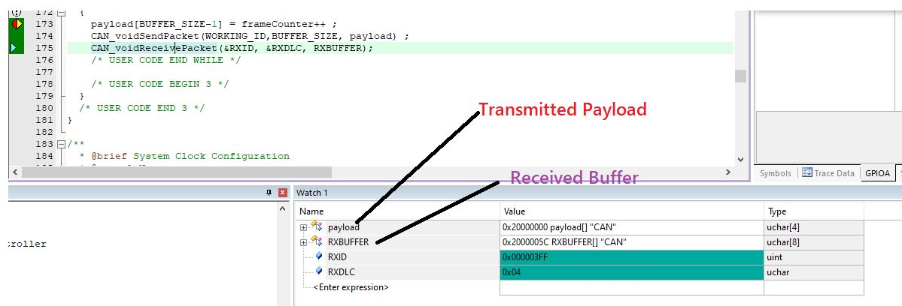
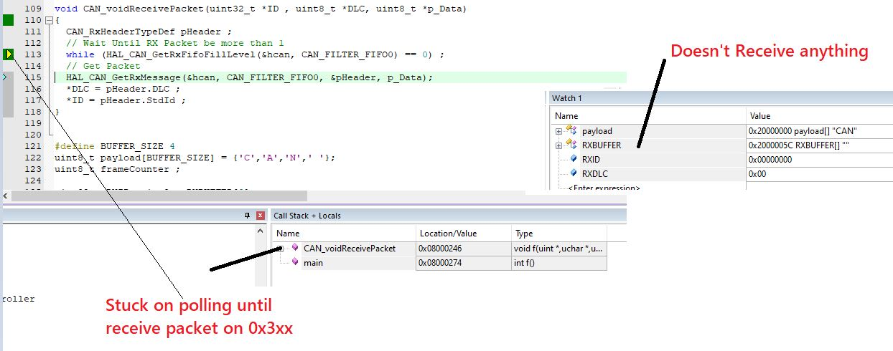

## CAN Controller    -  Case Study One / Send and Receive by Polling Mechanism  

### CAN Configuration 
```c
    CAN_HandleTypeDef hcan;
    hcan.Instance = CAN1;
    hcan.Init.Prescaler = 1;
    hcan.Init.Mode = CAN_MODE_LOOPBACK;
    hcan.Init.SyncJumpWidth = CAN_SJW_1TQ;
    hcan.Init.TimeSeg1 = CAN_BS1_6TQ;
    hcan.Init.TimeSeg2 = CAN_BS2_1TQ;
    hcan.Init.TimeTriggeredMode = DISABLE;
    hcan.Init.AutoBusOff = DISABLE;
    hcan.Init.AutoWakeUp = DISABLE;
    hcan.Init.AutoRetransmission = ENABLE;
    hcan.Init.ReceiveFifoLocked = DISABLE;
    hcan.Init.TransmitFifoPriority = DISABLE;
```
### CAN Bit-Timing 
```
Working Freq is 8 MHZ 
Needed Speed 1Mbps
Quanta Time (Tq) = Prescaler / Freq  = 1/8000000 = (1/8) microsecond
Number of Time Quanta to get 100 Kbps  => (1/8000000)sec * Num.OfQuanta = 1000000 Mbps
    Num.OfQuanta = 8 ; 
```
  

## Working Mode 
```
Loopback Mode 
In Loop Back Mode, the bxCAN treats its own transmitted messages as received messages and stores them (if they pass acceptance filtering) in a Receive mailbox.
This mode is provided for self-test functions. 
```


## Filter Received Messages
```
Working Mode is One 32-Bit Filter - Identifier Mask
32-Bit Filter --> Filter the incoming data by the whole frame, so we can receive the remote frame only or receive any specific shape of the frame.
Identifier Mask --> This Mask helps us to select which bit must match and which but I don't care about its value.
    Available Options for ID Mask 
        0: Don’t care, the bit is not used for the comparison
        1: Must match
```


## Example 
### **Try to Send Data with address 0x3ff and accept any msg with filter starts with 0x3xx**
```c
// 9-bit ID 0b0011 1111 1xxx
#define WORKING_ID	0x3ff
#define RX_MASK	    0b111100000000
```


### **Try to Send Data with address 0x1ff and accept any msg with filter starts with 0x3xx**
```c
#define WORKING_ID	0x1ff
#define RX_MASK	    0b111100000000
```


## Contributing  
Bug reports, feature requests, and so on are always welcome. Feel free to leave a note in the Issues section.

