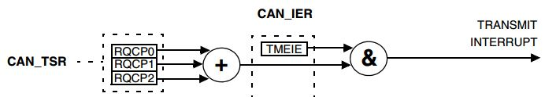
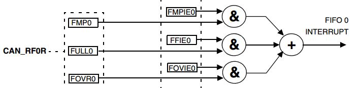
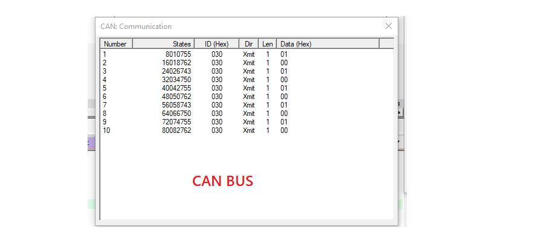

## CAN Controller    -  Case Study One / Send and Receive by Interrupt Mechanism  

### **CAN Configuration**
```c
  hcan.Instance = CAN1;
  hcan.Init.Prescaler = 1;
  hcan.Init.Mode = CAN_MODE_NORMAL;
  hcan.Init.SyncJumpWidth = CAN_SJW_1TQ;
  hcan.Init.TimeSeg1 = CAN_BS1_6TQ;
  hcan.Init.TimeSeg2 = CAN_BS2_1TQ;
  hcan.Init.TimeTriggeredMode = DISABLE;
  hcan.Init.AutoBusOff = DISABLE;
  hcan.Init.AutoWakeUp = DISABLE;
  hcan.Init.AutoRetransmission = ENABLE;
  hcan.Init.ReceiveFifoLocked = DISABLE;
  hcan.Init.TransmitFifoPriority = DISABLE;
```
### **Transmit Packet**
The transmit interrupt can be generated by the following events:  
* Transmit `mailbox 0 becomes empty`, RQCP0 bit in the CAN_TSR register set.  
* Transmit `mailbox 1 becomes empty`, RQCP1 bit in the CAN_TSR register set.  
* Transmit `mailbox 2 becomes empty`, RQCP2 bit in the CAN_TSR register set.  



### **Receive Packet**
The FIFO 0 interrupt can be generated by the following events:
* Reception of a `new message`, FMP0 bits in the CAN_RF0R register are not `00`.
* `FIFO0 full` condition, FULL0 bit in the CAN_RF0R register set.
* `FIFO0 overrun` condition, FOVR0 bit in the CAN_RF0R register set.




## Example 
**We Have 2 ECUs one responsible for accelerating and decelerating the vehicle [ECU2] and another responsible for transmitting the state command for accelerating or decelerating [ECU1]**
```c
// 9-bit ID 0b0011 1010 1xxx s
#define ECU1_ID		0x3AB
#define ECU2_ID		0x030
#define RX_MASK	    0b111111111000
```
ECU1 Sending the command to ECU2   




## Contributing  
Bug reports, feature requests, and so on are always welcome. Feel free to leave a note in the Issues section.

