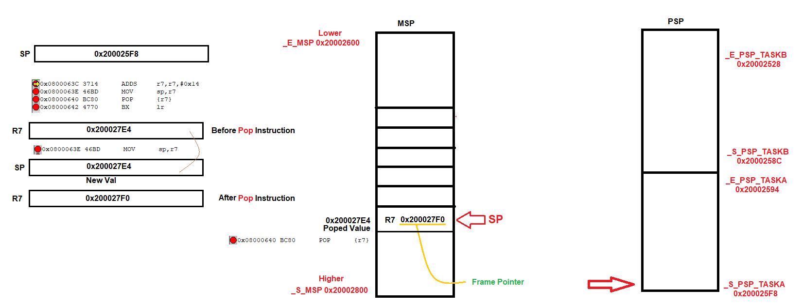

# ARM-V7 Session 5 -- Switching Between Stack Pointers 
## **Lab Overview** 
- Create Boundaries for Main Stack Pointer(MSP) and Process Stack Pointer(PSP) for Task A and Task B. 
- Task Scheduling based on EXTI
- Tasks Will Run in the user access level and the scheduler runs in the privileged access level.
## **Memory Layout**
    Linkerscript File 


    Get the symbol that refers to the stack top from the startup.s file 


    Layout Design


## **Analysis**
1. Set Boundaries 
```c
	// Main Stack Pointer
	_S_MSP = (u32) &_estack ;
	_E_MSP = _S_MSP - MAIN_STACK_SIZE ; // Decrement because ARM-Cortex has Full-Descending stack model

	// Process Stack of Task A
	_S_PSP_TASKA = _E_MSP - 8 ; // Add 2 Word as safety between stacks
	_E_PSP_TASKA = _S_PSP_TASKA - TASKA_SIZE ;

	// Process Stack of Task B
	_S_PSP_TASKB = _E_PSP_TASKA - 8 ; // Add 2 Word as safety between stacks
	_E_PSP_TASKB = _S_PSP_TASKB - TASKB_SIZE ;
```
2. When Task is Ready start making   
2.1 Set The PSP value by the start of the task stack 
    ```c
    #define SET_PSP(ADDRESS) __asm("MOV r0,%0 \n\t MSR PSP , r0 " : : "r"(ADDRESS))
    SET_PSP(_S_PSP_TASKA);  
    ```
    2.2 Change the working stack area (MSP) to the process stack area (PSP of TaskA)
    ```c
    (void)PSRC_voidSetUsageStackPointer(PSRC_PSP , 0);
    ```
    2.3 Switch from the Privileged Level to Unprivileged level access to make task working on unprivileged access
    ```c
    (void)PSRC_voidSetAccessLevel(PSRC_UNPRIVILEGED_ACCESS, 0) ;
    ```
3. After finishing the execution of the task   
    3.1 Switch from unprivileged access level to privileged access level by generating SVC interrupt
    ```c
    #define OS_GENERATE_EXC()   __asm("SVC #0x3");
    OS_GENERATE_EXC();
    ```
    3.2 Set the SP to MSP 
    ```c
    (void)PSRC_voidSetUsageStackPointer(PSRC_MSP , 0);
    ```
## **ARM Procedure Call Standard**
 The stack frame (starting from it’s bottom) generally contains the return address (previous LR), previous Frame Pointer, any registers that need to be preserved, function parameters (in case the function accepts more than 4), local variables, etc.
 the structural parts of a function :
 1. Prologue : sets up the environment for the function
 2. Body : implements the function’s logic and stores result to R0.
 3. Epilogue : restores the state so that the program can resume from where it left of before calling the function. the Stack Frame gets destroyed during the epilogue of a function.


Another key point to know about the functions is their types: leaf and non-leaf. The leaf function is a kind of a function which does not call/branch to another function from itself. A non-leaf function is a kind of a function which in addition to it’s own logic’s does call/branch to another function. 

## **Problem in a Function call in our lab**
At first, we set the address of TaskA/TaskB in PSP Reg using This Macro 
```c
#define SET_PSP(ADDRESS) __asm("MOV r0,%0 \n\t MSR PSP , r0 " : : "r"(ADDRESS))
```
Then We Call the Function Called `PSRC_voidSetUsageStackPointer`. When Calling this function we were using Main Stack as an area stack pointer pointed. but inside Function, we apply this assembly code that switches stack pointer to points to process the stack pointer of TaskA/TaskB. 
```c
    __asm(
            "MRS R0,CONTROL \n\t"
            "ORR R0,R0,#0b010   \n\t"
            "MSR CONTROL,R0 "
        );
```
So, We make Context switching using MSP  
Before Switching  
SP --> MAIN STACK 


When Switching  
SP --> PSP of Task A


When Context restored 
1. Destroy Stack by increasing SP by 0x14
2. ld <-- R7 (Frame Pointer of the Caller - Main Function -)
3. POP the R7 from Main Stack Area into R7 Reg.
4. Return Back.



Now Stack Pointer is pointed to address `0x200027E8` That address is related to the area of The Main stack even if we pointed to `PSP` and that is shown in the next function call.


So, Due to Context Switching using Main Stack Area and changing the stack pointer, The MSB = PSP even if in some way saves our boundaries in `PSRC_voidSetUsageStackPointer`, the function `PSRC_voidSetAccessLevel` will build its stack on the task stack. 


## **Solve Problem**
Change `PSRC_voidSetUsageStackPointer` to Macro or be naked function. 


## **Another Problem**
Here we used PSP for stacking operations but there is a con, the `PSRC_voidSetAccessLevel` will make a context switch in TaskA/TaskB Stack.  


## **Solve it**
Update the functions instead of using a normal function that makes switch context and switch restore, Use it as inline function, or make a macro function to avoid the calling/restoring stack, and don't build stacks doesn't matter the task stack.
So Will Update the `PSRC_interface` Library for Version 2.0 that will support the nacked attribuite while calling the Function
The compiler does not generate prologue and epilogue sequences for functions with `__attribute__((naked)).` and always will support inline functions.

## *Contributing*  
Bug reports, feature requests, and so on are always welcome. Feel free to leave a note in the Issues section.
