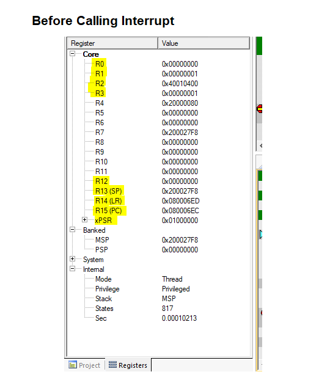
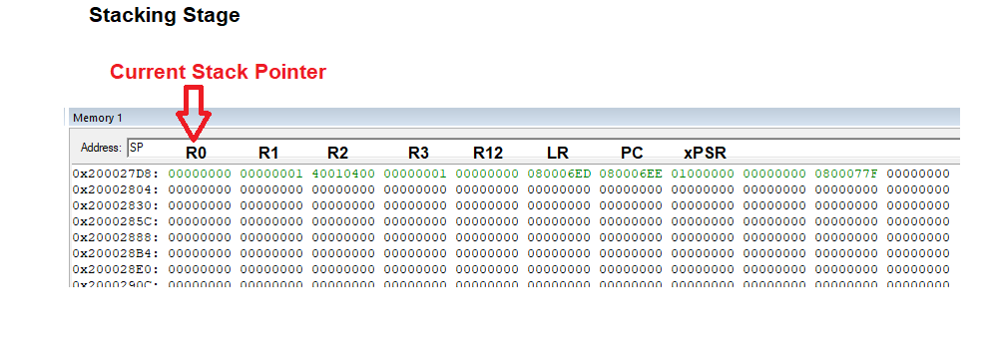
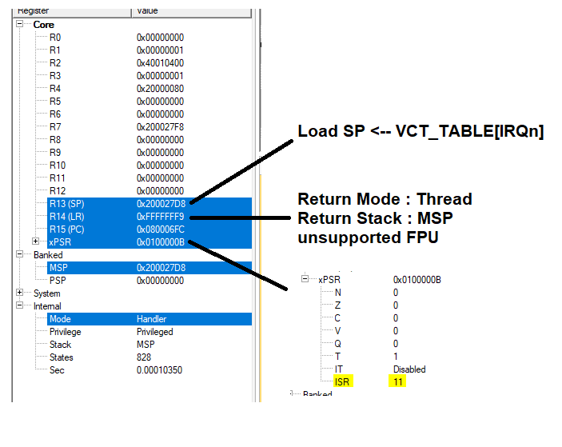
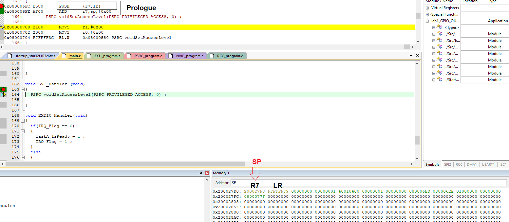
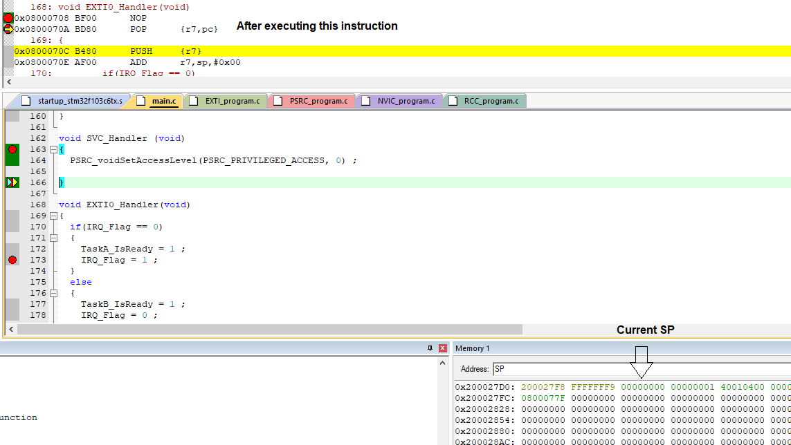
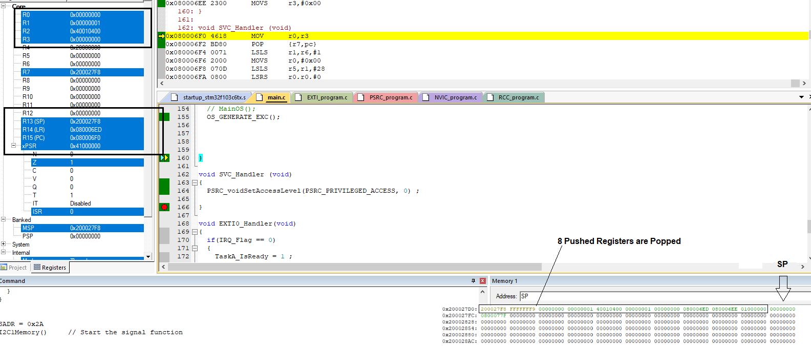

# ARM-V7 Session 6 -- Exceptions and Interrupts. 
## **Overview** 
- Entrance Procedure of Exceptions.
- Exit Procedure of Exceptions
## **Entrance Procedure of Exceptions**
Steps: 
1. Finish Current Instruction execution. 
2. Push Context - 8-Reg - onto the current working stack (MSP or PSP)

3. Switch to Handler Mode using MSP
4. Load  
4.1  SP   <-- Handler Address   
4.2  LR   <-- EXC_RETURN  
4.3  xPSR <-- Load with ISR Number (Number of Excption + IRQn)  
  
5. Start Handler Execution.  
    5.1 Perfome Prologue of the handler function.   

      

## **Exit Procedure of Exceptions**
1. Perform the Epilogue of the Function call

2. Select Returning stack and restore the context   
The lr register holds the value of `EXC_RETURN instead` of the return value. The `EXC_RETURN` value is generated at the exception entrance and is stored in the Link Register (LR). When this value is written to the PC with one of the allowed exception return instructions that the MSB is `0xF`, it triggers the exception return sequence. 

3. Resume execution of Thread code.

## **Interrupt Latency**
-  The delay between the start of an Interrupt Request (IRQ) and the start of the respective Interrupt Service Routine (ISR)  
-   Minimum Latency in cortex-m is About 12 Cycle

## **Measuring Interrupt Latency** 
-   Using Oscilloscope
-   Using Timers 
## *Contributing*  
Bug reports, feature requests, and so on are always welcome. Feel free to leave a note in the Issues section.