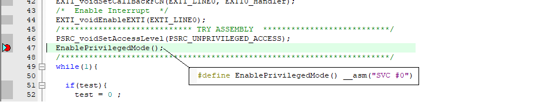
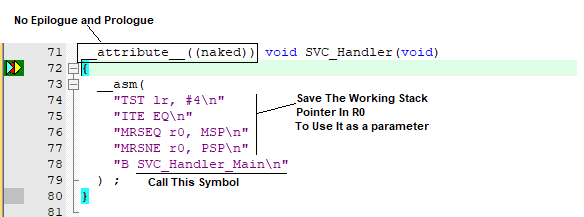
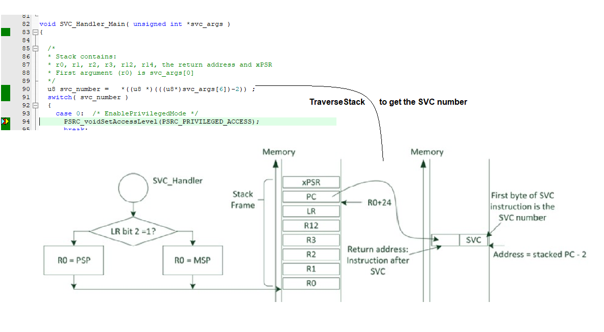
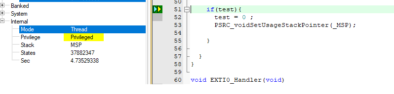

# ARM-V7 Session 7 -- SVC
## **Overview** 
- Generate SVC exception and get service ID.
## **Handling a SVC**
For that, the program needs to insert the SVC instruction into the code. This instruction has a parameter (for Thumb code 0-255) to select different SVC functions. The example generates SVC 0. But also have in mind, that other software components in the project may use this already. Select another parameter value then.

With Arm Compiler 6: With this compiler, an inline assembler needs to be used to generate something equivalent:

  

Checking The Working Stack Pointer to save it in R0 to use it as a parm to function, Used it as Naked to ignore function call process epilogue and prologue. 

  

start to traverse the stack to get the PC to get the SVC address and get the Service ID Number. 

  

After getting SVC Service ID and Performing the corresponding Code. 

## **Contributing**  

Bug reports, feature requests, and so on are always welcome. Feel free to leave a note in the Issues section.