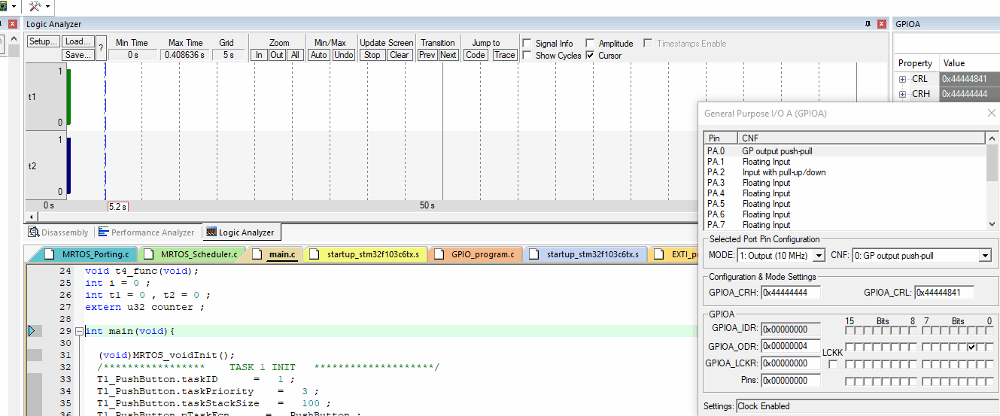

## Queue Example

In this example we created 2 tasks with the same priority.  

in file `MRTOS_Porting.h` Enable usage of queue `ENABLE_QUEUE_MSG_BOX` then add the required size in `MAX_QUEUE_MSG_SIZE`
```c
#define ENABLE_QUEUE_MSG_BOX 		1

	#if ENABLE_QUEUE_MSG_BOX == 1
    	#define MAX_QUEUE_MSG_SIZE			1
    #endif
```
So we need to share the value of button between pushButton task and LED task.



## Contributing  
Bug reports, feature requests, and so on are always welcome. Feel free to leave a note in the Issues section.

