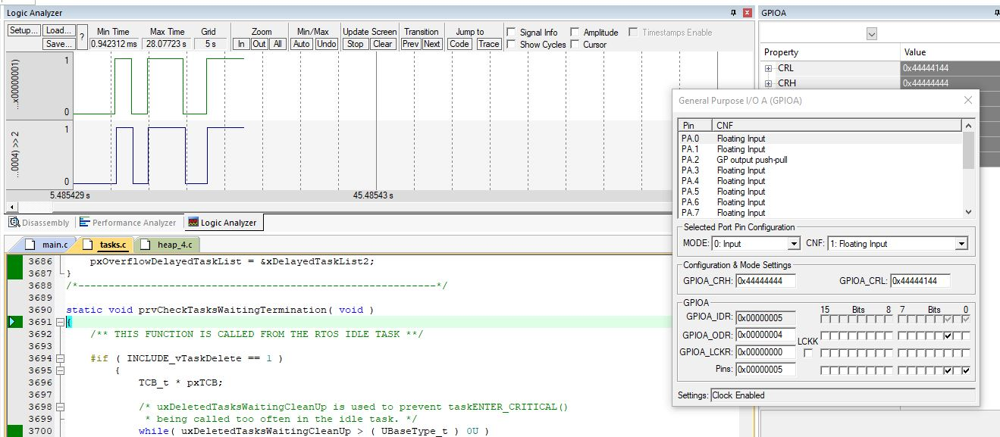
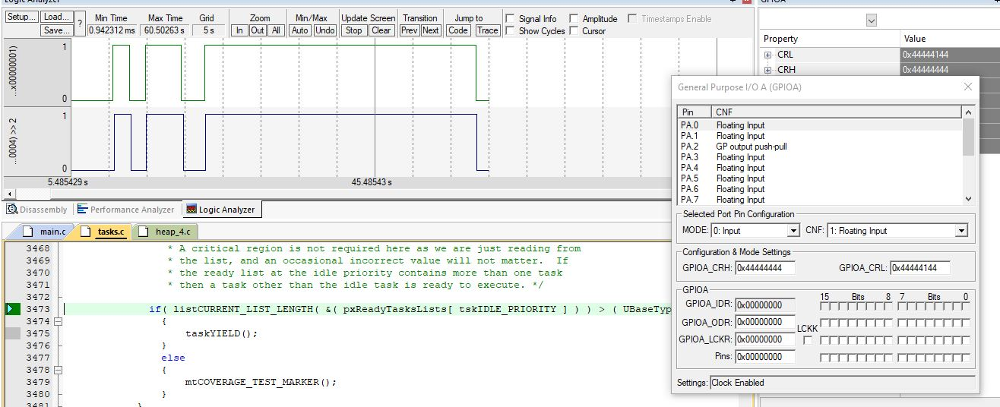

## FreeRTOS  -  Task Synchronization  

Button Function Give the Semaphore When Happen any change in button logic and the LED function try to take it to set the new change on the led 

> LED on 
  
 
 > LED off

## Contributing  
Bug reports, feature requests, and so on are always welcome. Feel free to leave a note in the Issues section.

